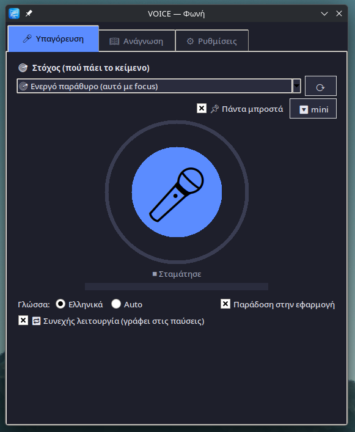
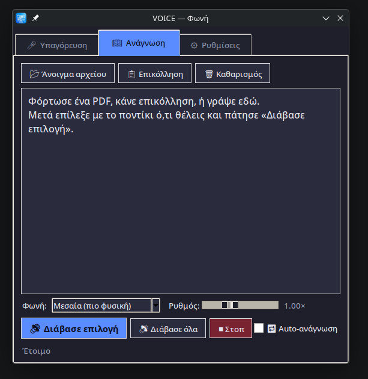
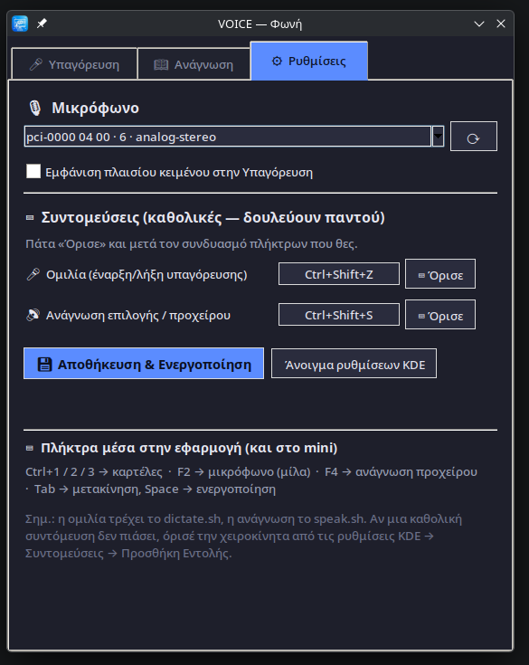
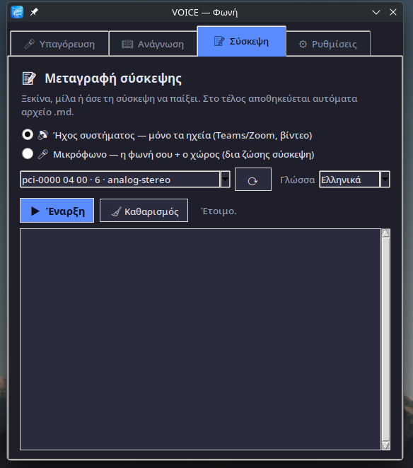
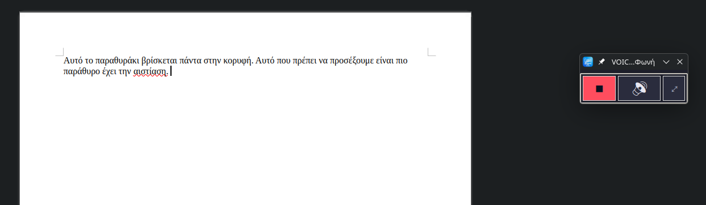

<p align="center">
  
</p>

<h1 align="center">VOICE — Greek Voice Keyboard &amp; Read-Aloud</h1>

<p align="center">
  <em>V.O.I.C.E — Voice On-device Intelligent Control Environment</em><br>
  Fully <strong>local, offline</strong> Greek speech-to-text &amp; text-to-speech for Linux — no GPU, no cloud.
</p>

<p align="center">
  
  
  
  
</p>

---

Built as the base for an accessibility tool: **talk to type**, and have **any text read back** to you. All inference runs on-device — your voice never leaves your computer.

- **🎤 Dictation (STT)** — speak Greek, it types/pastes into any app. Engine: [whisper.cpp](https://github.com/ggerganov/whisper.cpp) (CPU).
- **📖 Read-aloud (TTS)** — load a PDF, paste, or type, then hear it in Greek. Engine: [Piper](https://github.com/rhasspy/piper).
- **📝 Meeting transcription** — capture **system audio** (Teams/Zoom, video playback) or your **microphone** (in-person), live-transcribe every phrase with a timestamp, then export a Markdown file (`meeting-YYYY-MM-DD-HHMMSS.md`). Runs in the background — minimize it and it keeps writing.
- **🎯 Voice remote** — pick a target app (Claude, KWrite, browser…); dictated text lands there via KWin window activation + clipboard paste.
- **🔁 Hands-free** continuous mode with automatic pause detection (VAD).
- **🔽 Mini mode** — a tiny always-on-top floating bar with 🎤 / 🔊.
- **📍 System-tray icon** — close to the tray; right-click to talk, read, or quit.
- **⌨ Global shortcuts** + in-app keyboard navigation.

## Requirements

| | |
|---|---|
| **OS** | **Fedora KDE** (developed & tested on Fedora 44, KDE Plasma) |
| **Session** | **Wayland** — uses KWin `WindowsRunner` (D-Bus) for window activation and `ydotool` for paste |
| **CPU** | 64-bit x86_64, 4 cores minimum — **8 cores recommended** (whisper.cpp runs on CPU) |
| **RAM** | 8 GB |
| **Disk** | ~0.6 GB for the speech models (downloaded once on first launch into `~/.local/share/voice/`) |
| **Internet** | Only for the one-time model download — everything after runs fully offline |

> Other distros / desktops may work but are untested. The voice remote (window
> activation) and global shortcuts are written against **KDE Plasma on Wayland**;
> X11 or GNOME would need adjustments.

## Screenshots

| 🎤 Dictation | 📖 Read-aloud | ⚙ Settings |
|:---:|:---:|:---:|
|  |  |  |
| Pick where text goes, talk, live mic level, continuous mode | Read selection / clipboard / PDF, pick voice &amp; speed | Mic, global shortcuts, in-app keys |

| 📝 Meeting | 🔽 Mini mode |
|:---:|:---:|
|  |  |
| Capture system audio or mic, live timestamped transcript, export to `.md` | Tiny always-on-top 🎤 / 🔊 bar over any window |

## Install (Fedora / RPM)

The easiest way on Fedora KDE. `dnf` pulls every runtime dependency automatically.

```bash
# grab the .rpm from the latest release, then:
sudo dnf install ./voice-0.0.2-1.fc44.x86_64.rpm
```

Launch **“VOICE — Φωνή”** from the app menu, or run `voice`. The speech models
(~0.6 GB) are **not** in the package — they download once on first launch into
`~/.local/share/voice/`.

**Build the RPM yourself** (needs `whisper.cpp` built + `piper_tts/` present — see [SETUP.md](SETUP.md)):

```bash
sudo dnf install -y rpm-build patchelf
./build_rpm.sh        # → build/rpm/RPMS/x86_64/voice-*.rpm
```

## Run from source

See [SETUP.md](SETUP.md) for the full walkthrough (permissions, ydotool daemon, Piper voice). In short:

```bash
# 1. engines
sudo dnf install -y ydotool gcc-c++ cmake make poppler-utils

# 2. build whisper.cpp (CPU-only, small binary)
git clone --depth 1 https://github.com/ggerganov/whisper.cpp.git
cmake -S whisper.cpp -B whisper.cpp/build -DGGML_NATIVE=ON && cmake --build whisper.cpp/build -j8

# 3. models (Greek)
mkdir -p models voices piper_tts
curl -L -o models/ggml-small.bin https://huggingface.co/ggerganov/whisper.cpp/resolve/main/ggml-small.bin
# Piper binary + el_GR-rapunzelina voice — see SETUP.md

# 4. run
python3 voice_keyboard.py
```

> **Note:** the large `models/`, `voices/`, and `whisper.cpp/` directories are **not** versioned — they are fetched by the setup steps above.

## Usage

- **Dictation tab** — choose **Στόχος** (target app, or "active window"), press the mic (or the global shortcut) and speak. Text is pasted into the target.
- **Continuous mode** — tick *Συνεχής λειτουργία*; it transcribes and delivers on every pause.
- **Read-aloud tab** — open a PDF / paste / type, select text, press *Διάβασε επιλογή* (or *Διάβασε όλα*).
- **Meeting tab (Σύσκεψη)** — pick **🔊 Ήχος συστήματος** (records the speakers — remote Teams/Zoom participants, video) or **🎤 Μικρόφωνο** (your voice + the room, for in-person), press *Έναρξη*, and each phrase is appended with a timestamp. Press *Ολοκλήρωση & αποθήκευση* to export a `.md` file. Set the export folder in **Ρυθμίσεις → Φάκελος εξαγωγής συσκέψεων** (defaults to your home folder).
- **Mini mode** — collapse to a floating 🎤 / 🔊 bar; great for overlaying any window.
- **Tray** — closing the window keeps VOICE running in the system tray; use **Έξοδος** to quit fully.

Global shortcuts are set in **Ρυθμίσεις** (press *Όρισε* and hit the combo) — e.g. `Ctrl+Shift+Z` to dictate, `Ctrl+Shift+S` to read.

## Components

| File | Role |
|------|------|
| `voice_keyboard.py` | Main app — tabbed window (Dictation / Reading / Meeting / Settings) + tray |
| `read_aloud.py` | Reading view (also runnable standalone) |
| `dictate.sh` | Push-to-talk dictation, for a global hotkey |
| `speak.sh` | Read selection/clipboard aloud, for a global hotkey |
| `SETUP.md` | Full install &amp; permission setup |

## Stack

- **STT**: whisper.cpp + `ggml-small` (Greek)
- **TTS**: Piper + `el_GR-rapunzelina-medium`
- **Typing/paste**: ydotool (Wayland uinput)
- **Window control**: KWin `WindowsRunner` over D-Bus
- **Tray**: StatusNotifierItem via AppIndicator
- **UI**: pure standard-library Tkinter (no pip dependencies)

All inference is local and offline.

## License

See [LICENSE](LICENSE).
